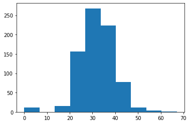

# Week 1


```python
import pandas as pd
import numpy as np
import matplotlib.pyplot as plt
import seaborn as sns
```


```python
data = pd.read_csv('health care diabetes.csv')
```


```python
data.head()
```


<div>
<style scoped>
    .dataframe tbody tr th:only-of-type {
        vertical-align: middle;
    }

    .dataframe tbody tr th {
        vertical-align: top;
    }

    .dataframe thead th {
        text-align: right;
    }
</style>
<table border="1" class="dataframe">
  <thead>
    <tr style="text-align: right;">
      <th></th>
      <th>Pregnancies</th>
      <th>Glucose</th>
      <th>BloodPressure</th>
      <th>SkinThickness</th>
      <th>Insulin</th>
      <th>BMI</th>
      <th>DiabetesPedigreeFunction</th>
      <th>Age</th>
      <th>Outcome</th>
    </tr>
  </thead>
  <tbody>
    <tr>
      <th>0</th>
      <td>6</td>
      <td>148</td>
      <td>72</td>
      <td>35</td>
      <td>0</td>
      <td>33.6</td>
      <td>0.627</td>
      <td>50</td>
      <td>1</td>
    </tr>
    <tr>
      <th>1</th>
      <td>1</td>
      <td>85</td>
      <td>66</td>
      <td>29</td>
      <td>0</td>
      <td>26.6</td>
      <td>0.351</td>
      <td>31</td>
      <td>0</td>
    </tr>
    <tr>
      <th>2</th>
      <td>8</td>
      <td>183</td>
      <td>64</td>
      <td>0</td>
      <td>0</td>
      <td>23.3</td>
      <td>0.672</td>
      <td>32</td>
      <td>1</td>
    </tr>
    <tr>
      <th>3</th>
      <td>1</td>
      <td>89</td>
      <td>66</td>
      <td>23</td>
      <td>94</td>
      <td>28.1</td>
      <td>0.167</td>
      <td>21</td>
      <td>0</td>
    </tr>
    <tr>
      <th>4</th>
      <td>0</td>
      <td>137</td>
      <td>40</td>
      <td>35</td>
      <td>168</td>
      <td>43.1</td>
      <td>2.288</td>
      <td>33</td>
      <td>1</td>
    </tr>
  </tbody>
</table>
</div>


```python
data.isnull().any()
```


    Pregnancies                 False
    Glucose                     False
    BloodPressure               False
    SkinThickness               False
    Insulin                     False
    BMI                         False
    DiabetesPedigreeFunction    False
    Age                         False
    Outcome                     False
    dtype: bool


```python
data.info()

```

    <class 'pandas.core.frame.DataFrame'>
    RangeIndex: 768 entries, 0 to 767
    Data columns (total 9 columns):
     #   Column                    Non-Null Count  Dtype  
    ---  ------                    --------------  -----  
     0   Pregnancies               768 non-null    int64  
     1   Glucose                   768 non-null    int64  
     2   BloodPressure             768 non-null    int64  
     3   SkinThickness             768 non-null    int64  
     4   Insulin                   768 non-null    int64  
     5   BMI                       768 non-null    float64
     6   DiabetesPedigreeFunction  768 non-null    float64
     7   Age                       768 non-null    int64  
     8   Outcome                   768 non-null    int64  
    dtypes: float64(2), int64(7)
    memory usage: 54.1 KB


```python
Positive = data[data['Outcome']==1]
Positive.head(5)
```


<div>
<style scoped>
    .dataframe tbody tr th:only-of-type {
        vertical-align: middle;
    }

    .dataframe tbody tr th {
        vertical-align: top;
    }

    .dataframe thead th {
        text-align: right;
    }
</style>
<table border="1" class="dataframe">
  <thead>
    <tr style="text-align: right;">
      <th></th>
      <th>Pregnancies</th>
      <th>Glucose</th>
      <th>BloodPressure</th>
      <th>SkinThickness</th>
      <th>Insulin</th>
      <th>BMI</th>
      <th>DiabetesPedigreeFunction</th>
      <th>Age</th>
      <th>Outcome</th>
    </tr>
  </thead>
  <tbody>
    <tr>
      <th>0</th>
      <td>6</td>
      <td>148</td>
      <td>72</td>
      <td>35</td>
      <td>0</td>
      <td>33.6</td>
      <td>0.627</td>
      <td>50</td>
      <td>1</td>
    </tr>
    <tr>
      <th>2</th>
      <td>8</td>
      <td>183</td>
      <td>64</td>
      <td>0</td>
      <td>0</td>
      <td>23.3</td>
      <td>0.672</td>
      <td>32</td>
      <td>1</td>
    </tr>
    <tr>
      <th>4</th>
      <td>0</td>
      <td>137</td>
      <td>40</td>
      <td>35</td>
      <td>168</td>
      <td>43.1</td>
      <td>2.288</td>
      <td>33</td>
      <td>1</td>
    </tr>
    <tr>
      <th>6</th>
      <td>3</td>
      <td>78</td>
      <td>50</td>
      <td>32</td>
      <td>88</td>
      <td>31.0</td>
      <td>0.248</td>
      <td>26</td>
      <td>1</td>
    </tr>
    <tr>
      <th>8</th>
      <td>2</td>
      <td>197</td>
      <td>70</td>
      <td>45</td>
      <td>543</td>
      <td>30.5</td>
      <td>0.158</td>
      <td>53</td>
      <td>1</td>
    </tr>
  </tbody>
</table>
</div>


```python
data['Glucose'].value_counts().head(10)
```


    100    17
    99     17
    129    14
    125    14
    111    14
    106    14
    95     13
    108    13
    105    13
    102    13
    Name: Glucose, dtype: int64


```python
plt.hist(data['Glucose'])
```


    (array([  5.,   0.,   4.,  32., 156., 211., 163.,  95.,  56.,  46.]),
     array([  0. ,  19.9,  39.8,  59.7,  79.6,  99.5, 119.4, 139.3, 159.2,
            179.1, 199. ]),
     <BarContainer object of 10 artists>)


```python
data['BloodPressure'].value_counts().head(10)
```


    70    57
    74    52
    68    45
    78    45
    72    44
    64    43
    80    40
    76    39
    60    37
    0     35
    Name: BloodPressure, dtype: int64


```python
plt.hist(data['BloodPressure'])
```


    (array([ 35.,   1.,   2.,  13., 107., 261., 243.,  87.,  14.,   5.]),
     array([  0. ,  12.2,  24.4,  36.6,  48.8,  61. ,  73.2,  85.4,  97.6,
            109.8, 122. ]),
     <BarContainer object of 10 artists>)


```python
data['SkinThickness'].value_counts().head(10)
```


    0     227
    32     31
    30     27
    27     23
    23     22
    33     20
    18     20
    28     20
    31     19
    39     18
    Name: SkinThickness, dtype: int64


```python
plt.hist(data['SkinThickness'])
```


    (array([231., 107., 165., 175.,  78.,   9.,   2.,   0.,   0.,   1.]),
     array([ 0. ,  9.9, 19.8, 29.7, 39.6, 49.5, 59.4, 69.3, 79.2, 89.1, 99. ]),
     <BarContainer object of 10 artists>)


```python
data['Insulin'].value_counts().head(10)
```


    0      374
    105     11
    140      9
    130      9
    120      8
    100      7
    94       7
    180      7
    110      6
    115      6
    Name: Insulin, dtype: int64


```python
plt.hist(data['Insulin'])
```


    (array([487., 155.,  70.,  30.,   8.,   9.,   5.,   1.,   2.,   1.]),
     array([  0. ,  84.6, 169.2, 253.8, 338.4, 423. , 507.6, 592.2, 676.8,
            761.4, 846. ]),
     <BarContainer object of 10 artists>)


```python
data['BMI'].value_counts().head(10)
```


    32.0    13
    31.6    12
    31.2    12
    0.0     11
    33.3    10
    32.4    10
    32.8     9
    30.8     9
    32.9     9
    30.1     9
    Name: BMI, dtype: int64


```python
plt.hist(data['BMI'])
```


    (array([ 11.,   0.,  15., 156., 268., 224.,  78.,  12.,   3.,   1.]),
     array([ 0.  ,  6.71, 13.42, 20.13, 26.84, 33.55, 40.26, 46.97, 53.68,
            60.39, 67.1 ]),
     <BarContainer object of 10 artists>)





```python
data.describe().transpose()
```


<div>
<style scoped>
    .dataframe tbody tr th:only-of-type {
        vertical-align: middle;
    }

    .dataframe tbody tr th {
        vertical-align: top;
    }

    .dataframe thead th {
        text-align: right;
    }
</style>
<table border="1" class="dataframe">
  <thead>
    <tr style="text-align: right;">
      <th></th>
      <th>count</th>
      <th>mean</th>
      <th>std</th>
      <th>min</th>
      <th>25%</th>
      <th>50%</th>
      <th>75%</th>
      <th>max</th>
    </tr>
  </thead>
  <tbody>
    <tr>
      <th>Pregnancies</th>
      <td>768.0</td>
      <td>3.845052</td>
      <td>3.369578</td>
      <td>0.000</td>
      <td>1.00000</td>
      <td>3.0000</td>
      <td>6.00000</td>
      <td>17.00</td>
    </tr>
    <tr>
      <th>Glucose</th>
      <td>768.0</td>
      <td>120.894531</td>
      <td>31.972618</td>
      <td>0.000</td>
      <td>99.00000</td>
      <td>117.0000</td>
      <td>140.25000</td>
      <td>199.00</td>
    </tr>
    <tr>
      <th>BloodPressure</th>
      <td>768.0</td>
      <td>69.105469</td>
      <td>19.355807</td>
      <td>0.000</td>
      <td>62.00000</td>
      <td>72.0000</td>
      <td>80.00000</td>
      <td>122.00</td>
    </tr>
    <tr>
      <th>SkinThickness</th>
      <td>768.0</td>
      <td>20.536458</td>
      <td>15.952218</td>
      <td>0.000</td>
      <td>0.00000</td>
      <td>23.0000</td>
      <td>32.00000</td>
      <td>99.00</td>
    </tr>
    <tr>
      <th>Insulin</th>
      <td>768.0</td>
      <td>79.799479</td>
      <td>115.244002</td>
      <td>0.000</td>
      <td>0.00000</td>
      <td>30.5000</td>
      <td>127.25000</td>
      <td>846.00</td>
    </tr>
    <tr>
      <th>BMI</th>
      <td>768.0</td>
      <td>31.992578</td>
      <td>7.884160</td>
      <td>0.000</td>
      <td>27.30000</td>
      <td>32.0000</td>
      <td>36.60000</td>
      <td>67.10</td>
    </tr>
    <tr>
      <th>DiabetesPedigreeFunction</th>
      <td>768.0</td>
      <td>0.471876</td>
      <td>0.331329</td>
      <td>0.078</td>
      <td>0.24375</td>
      <td>0.3725</td>
      <td>0.62625</td>
      <td>2.42</td>
    </tr>
    <tr>
      <th>Age</th>
      <td>768.0</td>
      <td>33.240885</td>
      <td>11.760232</td>
      <td>21.000</td>
      <td>24.00000</td>
      <td>29.0000</td>
      <td>41.00000</td>
      <td>81.00</td>
    </tr>
    <tr>
      <th>Outcome</th>
      <td>768.0</td>
      <td>0.348958</td>
      <td>0.476951</td>
      <td>0.000</td>
      <td>0.00000</td>
      <td>0.0000</td>
      <td>1.00000</td>
      <td>1.00</td>
    </tr>
  </tbody>
</table>
</div>


```python
plt.hist(Positive['BMI'],histtype='stepfilled',bins=20, color = 'green')
```


    (array([ 2.,  0.,  0.,  0.,  0.,  0.,  3., 13., 38., 61., 61., 36., 27.,
            14.,  7.,  3.,  1.,  1.,  0.,  1.]),
     array([ 0.   ,  3.355,  6.71 , 10.065, 13.42 , 16.775, 20.13 , 23.485,
            26.84 , 30.195, 33.55 , 36.905, 40.26 , 43.615, 46.97 , 50.325,
            53.68 , 57.035, 60.39 , 63.745, 67.1  ]),
     [<matplotlib.patches.Polygon at 0x7f030e1a6890>])


```python
Positive['BMI'].value_counts().head(10)
```


    32.9    8
    31.6    7
    33.3    6
    30.5    5
    32.0    5
    31.2    5
    32.4    4
    30.4    4
    43.3    4
    34.3    4
    Name: BMI, dtype: int64


```python
plt.hist(Positive['Glucose'],histtype='stepfilled',bins=20, color = 'green')
```


    (array([ 2.,  0.,  0.,  0.,  0.,  0.,  0.,  1.,  4.,  9., 28., 26., 36.,
            27., 29., 22., 24., 21., 25., 14.]),
     array([  0.  ,   9.95,  19.9 ,  29.85,  39.8 ,  49.75,  59.7 ,  69.65,
             79.6 ,  89.55,  99.5 , 109.45, 119.4 , 129.35, 139.3 , 149.25,
            159.2 , 169.15, 179.1 , 189.05, 199.  ]),
     [<matplotlib.patches.Polygon at 0x7f030e0b1bd0>])


```python
Positive['Glucose'].value_counts().head(10)
```


    125    7
    158    6
    128    6
    115    6
    129    6
    146    5
    162    5
    173    5
    124    5
    109    5
    Name: Glucose, dtype: int64


```python
plt.hist(Positive['BloodPressure'],histtype='stepfilled',bins=20, color = 'green')
```


    (array([16.,  0.,  0.,  0.,  0.,  1.,  0.,  1.,  6.,  6., 19., 37., 56.,
            36., 41., 31.,  7.,  4.,  4.,  3.]),
     array([  0. ,   5.7,  11.4,  17.1,  22.8,  28.5,  34.2,  39.9,  45.6,
             51.3,  57. ,  62.7,  68.4,  74.1,  79.8,  85.5,  91.2,  96.9,
            102.6, 108.3, 114. ]),
     [<matplotlib.patches.Polygon at 0x7f030e043bd0>])


```python
Positive['BloodPressure'].value_counts().head(10)
```


    70    23
    76    18
    78    17
    74    17
    72    16
    0     16
    82    13
    64    13
    80    13
    68    12
    Name: BloodPressure, dtype: int64


```python
plt.hist(Positive['SkinThickness'],histtype='stepfilled',bins=20, color = 'green')
```


    (array([88.,  1.,  4., 10., 18., 30., 41., 34., 23., 15.,  1.,  1.,  1.,
             0.,  0.,  0.,  0.,  0.,  0.,  1.]),
     array([ 0.  ,  4.95,  9.9 , 14.85, 19.8 , 24.75, 29.7 , 34.65, 39.6 ,
            44.55, 49.5 , 54.45, 59.4 , 64.35, 69.3 , 74.25, 79.2 , 84.15,
            89.1 , 94.05, 99.  ]),
     [<matplotlib.patches.Polygon at 0x7f030dfc2b90>])


```python
Positive['SkinThickness'].value_counts().head(10)
```


    0     88
    32    14
    33     9
    30     9
    39     8
    35     8
    36     8
    37     8
    27     7
    29     7
    Name: SkinThickness, dtype: int64


```python
plt.hist(Positive['Insulin'],histtype='stepfilled',bins=20, color = 'green')
```


    (array([141.,   6.,  23.,  33.,  24.,  12.,   7.,   7.,   2.,   1.,   1.,
              5.,   3.,   1.,   1.,   0.,   0.,   0.,   0.,   1.]),
     array([  0. ,  42.3,  84.6, 126.9, 169.2, 211.5, 253.8, 296.1, 338.4,
            380.7, 423. , 465.3, 507.6, 549.9, 592.2, 634.5, 676.8, 719.1,
            761.4, 803.7, 846. ]),
     [<matplotlib.patches.Polygon at 0x7f030df444d0>])


```python
Positive['Insulin'].value_counts().head(10)
```


    0      138
    130      6
    180      4
    156      3
    175      3
    194      2
    125      2
    225      2
    220      2
    210      2
    Name: Insulin, dtype: int64


```python
#Scatter Plot
```


```python
BloodPressure = Positive['BloodPressure']
Glucose = Positive['Glucose']
SkinThickness = Positive['SkinThickness']
Insulin = Positive['Insulin']
BMI = Positive['BMI']
```


```python
plt.scatter(BloodPressure, Glucose, color=['g'])
plt.xlabel('BloodPressure')
plt.ylabel('Glucose')
plt.title('BloodPressure & Glucose')
plt.show()
```


```python
g =sns.scatterplot(x= "Glucose" ,y= "BloodPressure", hue="Outcome", data=data)
```


```python
B =sns.scatterplot(x= "BMI" ,y= "Insulin", hue="Outcome", data=data)
```


```python
S =sns.scatterplot(x= "SkinThickness" ,y= "Insulin", hue="Outcome", data=data)
```


```python
### correlation matrix
data.corr()
```


<div>
<style scoped>
    .dataframe tbody tr th:only-of-type {
        vertical-align: middle;
    }

    .dataframe tbody tr th {
        vertical-align: top;
    }

    .dataframe thead th {
        text-align: right;
    }
</style>
<table border="1" class="dataframe">
  <thead>
    <tr style="text-align: right;">
      <th></th>
      <th>Pregnancies</th>
      <th>Glucose</th>
      <th>BloodPressure</th>
      <th>SkinThickness</th>
      <th>Insulin</th>
      <th>BMI</th>
      <th>DiabetesPedigreeFunction</th>
      <th>Age</th>
      <th>Outcome</th>
    </tr>
  </thead>
  <tbody>
    <tr>
      <th>Pregnancies</th>
      <td>1.000000</td>
      <td>0.129459</td>
      <td>0.141282</td>
      <td>-0.081672</td>
      <td>-0.073535</td>
      <td>0.017683</td>
      <td>-0.033523</td>
      <td>0.544341</td>
      <td>0.221898</td>
    </tr>
    <tr>
      <th>Glucose</th>
      <td>0.129459</td>
      <td>1.000000</td>
      <td>0.152590</td>
      <td>0.057328</td>
      <td>0.331357</td>
      <td>0.221071</td>
      <td>0.137337</td>
      <td>0.263514</td>
      <td>0.466581</td>
    </tr>
    <tr>
      <th>BloodPressure</th>
      <td>0.141282</td>
      <td>0.152590</td>
      <td>1.000000</td>
      <td>0.207371</td>
      <td>0.088933</td>
      <td>0.281805</td>
      <td>0.041265</td>
      <td>0.239528</td>
      <td>0.065068</td>
    </tr>
    <tr>
      <th>SkinThickness</th>
      <td>-0.081672</td>
      <td>0.057328</td>
      <td>0.207371</td>
      <td>1.000000</td>
      <td>0.436783</td>
      <td>0.392573</td>
      <td>0.183928</td>
      <td>-0.113970</td>
      <td>0.074752</td>
    </tr>
    <tr>
      <th>Insulin</th>
      <td>-0.073535</td>
      <td>0.331357</td>
      <td>0.088933</td>
      <td>0.436783</td>
      <td>1.000000</td>
      <td>0.197859</td>
      <td>0.185071</td>
      <td>-0.042163</td>
      <td>0.130548</td>
    </tr>
    <tr>
      <th>BMI</th>
      <td>0.017683</td>
      <td>0.221071</td>
      <td>0.281805</td>
      <td>0.392573</td>
      <td>0.197859</td>
      <td>1.000000</td>
      <td>0.140647</td>
      <td>0.036242</td>
      <td>0.292695</td>
    </tr>
    <tr>
      <th>DiabetesPedigreeFunction</th>
      <td>-0.033523</td>
      <td>0.137337</td>
      <td>0.041265</td>
      <td>0.183928</td>
      <td>0.185071</td>
      <td>0.140647</td>
      <td>1.000000</td>
      <td>0.033561</td>
      <td>0.173844</td>
    </tr>
    <tr>
      <th>Age</th>
      <td>0.544341</td>
      <td>0.263514</td>
      <td>0.239528</td>
      <td>-0.113970</td>
      <td>-0.042163</td>
      <td>0.036242</td>
      <td>0.033561</td>
      <td>1.000000</td>
      <td>0.238356</td>
    </tr>
    <tr>
      <th>Outcome</th>
      <td>0.221898</td>
      <td>0.466581</td>
      <td>0.065068</td>
      <td>0.074752</td>
      <td>0.130548</td>
      <td>0.292695</td>
      <td>0.173844</td>
      <td>0.238356</td>
      <td>1.000000</td>
    </tr>
  </tbody>
</table>
</div>


```python
### create correlation heat map
sns.heatmap(data.corr())
```


    <AxesSubplot:>


```python
plt.subplots(figsize=(12,10))
sns.heatmap(data.corr(),annot=True,cmap='viridis')  ### gives correlation value
```


    <AxesSubplot:>


```python
plt.subplots(figsize=(12, 10))
sns.heatmap(data.corr(),annot=True)  ### gives correlation value
```


    <AxesSubplot:>


```python

```

# Week 2


```python
# Logistic Regreation and model building
```


```python
data.head(5)
```


<div>
<style scoped>
    .dataframe tbody tr th:only-of-type {
        vertical-align: middle;
    }

    .dataframe tbody tr th {
        vertical-align: top;
    }

    .dataframe thead th {
        text-align: right;
    }
</style>
<table border="1" class="dataframe">
  <thead>
    <tr style="text-align: right;">
      <th></th>
      <th>Pregnancies</th>
      <th>Glucose</th>
      <th>BloodPressure</th>
      <th>SkinThickness</th>
      <th>Insulin</th>
      <th>BMI</th>
      <th>DiabetesPedigreeFunction</th>
      <th>Age</th>
      <th>Outcome</th>
    </tr>
  </thead>
  <tbody>
    <tr>
      <th>0</th>
      <td>6</td>
      <td>148</td>
      <td>72</td>
      <td>35</td>
      <td>0</td>
      <td>33.6</td>
      <td>0.627</td>
      <td>50</td>
      <td>1</td>
    </tr>
    <tr>
      <th>1</th>
      <td>1</td>
      <td>85</td>
      <td>66</td>
      <td>29</td>
      <td>0</td>
      <td>26.6</td>
      <td>0.351</td>
      <td>31</td>
      <td>0</td>
    </tr>
    <tr>
      <th>2</th>
      <td>8</td>
      <td>183</td>
      <td>64</td>
      <td>0</td>
      <td>0</td>
      <td>23.3</td>
      <td>0.672</td>
      <td>32</td>
      <td>1</td>
    </tr>
    <tr>
      <th>3</th>
      <td>1</td>
      <td>89</td>
      <td>66</td>
      <td>23</td>
      <td>94</td>
      <td>28.1</td>
      <td>0.167</td>
      <td>21</td>
      <td>0</td>
    </tr>
    <tr>
      <th>4</th>
      <td>0</td>
      <td>137</td>
      <td>40</td>
      <td>35</td>
      <td>168</td>
      <td>43.1</td>
      <td>2.288</td>
      <td>33</td>
      <td>1</td>
    </tr>
  </tbody>
</table>
</div>


```python
features = data.iloc[:,[0,1,2,3,4,5,6,7]].values
label = data.iloc[:,8].values
```


```python
#Train test split
from sklearn.model_selection import train_test_split
X_train,X_test,y_train,y_test = train_test_split(features,
                                                label,
                                                test_size=0.2,
                                                random_state =10)
```


```python
#Create model
from sklearn.linear_model import LogisticRegression
model = LogisticRegression()
model.fit(X_train,y_train) 
```


    LogisticRegression()


```python
print(model.score(X_train,y_train))
print(model.score(X_test,y_test))
```

    0.7719869706840391
    0.7662337662337663


```python
from sklearn.metrics import confusion_matrix
cm = confusion_matrix(label,model.predict(features))
cm
```


    array([[446,  54],
           [122, 146]])


```python
from sklearn.metrics import classification_report
print(classification_report(label,model.predict(features)))
```

                  precision    recall  f1-score   support
    
               0       0.79      0.89      0.84       500
               1       0.73      0.54      0.62       268
    
        accuracy                           0.77       768
       macro avg       0.76      0.72      0.73       768
    weighted avg       0.77      0.77      0.76       768
    


```python
#Preparing ROC Curve (Receiver Operating Characteristics Curve)
from sklearn.metrics import roc_curve
from sklearn.metrics import roc_auc_score

# predict probabilities
probs = model.predict_proba(features)
# keep probabilities for the positive outcome only
probs = probs[:, 1]
# calculate AUC
auc = roc_auc_score(label, probs)
print('AUC: %.3f' % auc)
# calculate roc curve
fpr, tpr, thresholds = roc_curve(label, probs)
# plot no skill
plt.plot([0, 1], [0, 1], linestyle='--')
# plot the roc curve for the model
plt.plot(fpr, tpr, marker='.')
```

    AUC: 0.837


    [<matplotlib.lines.Line2D at 0x7f03068b8bd0>]


```python
#Applying Decission Tree Classifier
from sklearn.tree import DecisionTreeClassifier
model3 = DecisionTreeClassifier(max_depth=5)
model3.fit(X_train,y_train)
```


    DecisionTreeClassifier(max_depth=5)


```python
model3.score(X_train,y_train)
```


    0.8289902280130294


```python
model3.score(X_test,y_test)
```


    0.7727272727272727


```python
#Applying Random Forest
from sklearn.ensemble import RandomForestClassifier
model4 = RandomForestClassifier(n_estimators=11)
model4.fit(X_train,y_train)
```


    RandomForestClassifier(n_estimators=11)


```python
model4.score(X_train,y_train)
```


    0.990228013029316


```python
model4.score(X_test,y_test)
```


    0.7727272727272727


```python
#Support Vector Classifier

from sklearn.svm import SVC 
model5 = SVC(kernel='rbf',
           gamma='auto')
model5.fit(X_train,y_train)
```


    SVC(gamma='auto')


```python
model5.score(X_test,y_test)
```


    0.6168831168831169


```python
#Applying K-NN
from sklearn.neighbors import KNeighborsClassifier
model2 = KNeighborsClassifier(n_neighbors=7,
                             metric='minkowski',
                             p = 2)
model2.fit(X_train,y_train)
```


    KNeighborsClassifier(n_neighbors=7)


```python
#Preparing ROC Curve (Receiver Operating Characteristics Curve)
from sklearn.metrics import roc_curve
from sklearn.metrics import roc_auc_score

# predict probabilities
probs = model2.predict_proba(features)
# keep probabilities for the positive outcome only
probs = probs[:, 1]
# calculate AUC
auc = roc_auc_score(label, probs)
print('AUC: %.3f' % auc)
# calculate roc curve
fpr, tpr, thresholds = roc_curve(label, probs)
print("True Positive Rate - {}, False Positive Rate - {} Thresholds - {}".format(tpr,fpr,thresholds))
# plot no skill
plt.plot([0, 1], [0, 1], linestyle='--')
# plot the roc curve for the model
plt.plot(fpr, tpr, marker='.')
plt.xlabel("False Positive Rate")
plt.ylabel("True Positive Rate")

```

    AUC: 0.836
    True Positive Rate - [0.         0.06716418 0.23880597 0.44776119 0.60074627 0.75373134
     0.88059701 0.98507463 1.        ], False Positive Rate - [0.    0.    0.02  0.056 0.12  0.248 0.428 0.668 1.   ] Thresholds - [2.         1.         0.85714286 0.71428571 0.57142857 0.42857143
     0.28571429 0.14285714 0.        ]


    Text(0, 0.5, 'True Positive Rate')


```python
#Precision Recall Curve for Logistic Regression

from sklearn.metrics import precision_recall_curve
from sklearn.metrics import f1_score
from sklearn.metrics import auc
from sklearn.metrics import average_precision_score
# predict probabilities
probs = model.predict_proba(features)
# keep probabilities for the positive outcome only
probs = probs[:, 1]
# predict class values
yhat = model.predict(features)
# calculate precision-recall curve
precision, recall, thresholds = precision_recall_curve(label, probs)
# calculate F1 score
f1 = f1_score(label, yhat)
# calculate precision-recall AUC
auc = auc(recall, precision)
# calculate average precision score
ap = average_precision_score(label, probs)
print('f1=%.3f auc=%.3f ap=%.3f' % (f1, auc, ap))
# plot no skill
plt.plot([0, 1], [0.5, 0.5], linestyle='--')
# plot the precision-recall curve for the model
plt.plot(recall, precision, marker='.')

```

    f1=0.624 auc=0.726 ap=0.727


    [<matplotlib.lines.Line2D at 0x7f0305c0ba10>]


```python
#Precision Recall Curve for KNN

from sklearn.metrics import precision_recall_curve
from sklearn.metrics import f1_score
from sklearn.metrics import auc
from sklearn.metrics import average_precision_score
# predict probabilities
probs = model2.predict_proba(features)
# keep probabilities for the positive outcome only
probs = probs[:, 1]
# predict class values
yhat = model2.predict(features)
# calculate precision-recall curve
precision, recall, thresholds = precision_recall_curve(label, probs)
# calculate F1 score
f1 = f1_score(label, yhat)
# calculate precision-recall AUC
auc = auc(recall, precision)
# calculate average precision score
ap = average_precision_score(label, probs)
print('f1=%.3f auc=%.3f ap=%.3f' % (f1, auc, ap))
# plot no skill
plt.plot([0, 1], [0.5, 0.5], linestyle='--')
# plot the precision-recall curve for the model
plt.plot(recall, precision, marker='.')
```

    f1=0.658 auc=0.752 ap=0.709


    [<matplotlib.lines.Line2D at 0x7f0305b9c510>]


```python
#Precision Recall Curve for Decission Tree Classifier

from sklearn.metrics import precision_recall_curve
from sklearn.metrics import f1_score
from sklearn.metrics import auc
from sklearn.metrics import average_precision_score
# predict probabilities
probs = model3.predict_proba(features)
# keep probabilities for the positive outcome only
probs = probs[:, 1]
# predict class values
yhat = model3.predict(features)
# calculate precision-recall curve
precision, recall, thresholds = precision_recall_curve(label, probs)
# calculate F1 score
f1 = f1_score(label, yhat)
# calculate precision-recall AUC
auc = auc(recall, precision)
# calculate average precision score
ap = average_precision_score(label, probs)
print('f1=%.3f auc=%.3f ap=%.3f' % (f1, auc, ap))
# plot no skill
plt.plot([0, 1], [0.5, 0.5], linestyle='--')
# plot the precision-recall curve for the model
plt.plot(recall, precision, marker='.')
```

    f1=0.714 auc=0.815 ap=0.768


    [<matplotlib.lines.Line2D at 0x7f0305b1ae10>]


```python
#Precision Recall Curve for Random Forest

from sklearn.metrics import precision_recall_curve
from sklearn.metrics import f1_score
from sklearn.metrics import auc
from sklearn.metrics import average_precision_score
# predict probabilities
probs = model4.predict_proba(features)
# keep probabilities for the positive outcome only
probs = probs[:, 1]
# predict class values
yhat = model4.predict(features)
# calculate precision-recall curve
precision, recall, thresholds = precision_recall_curve(label, probs)
# calculate F1 score
f1 = f1_score(label, yhat)
# calculate precision-recall AUC
auc = auc(recall, precision)
# calculate average precision score
ap = average_precision_score(label, probs)
print('f1=%.3f auc=%.3f ap=%.3f' % (f1, auc, ap))
# plot no skill
plt.plot([0, 1], [0.5, 0.5], linestyle='--')
# plot the precision-recall curve for the model
plt.plot(recall, precision, marker='.')
```

    f1=0.922 auc=0.972 ap=0.965


    [<matplotlib.lines.Line2D at 0x7f0305aa76d0>]


```python

```
